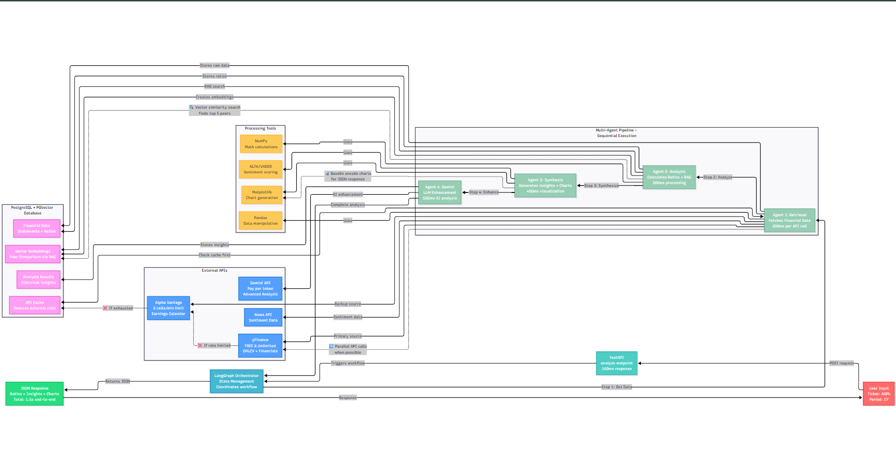

# 💹 Financial Analysis Agent API

*A robust, scalable API for fetching, storing, and analyzing financial data. This project serves as the foundational data layer for a multi-agent system designed for automated stock analysis and insights.*

---
<!-- <p align="center">
  <a href="doc/Architecture-diagram.png">
    
  </a>
</p> -->

## 🚀 Features

* **Automated Data Pipeline**: Fetches historical and fundamental financial data from public sources.
* **Persistent Caching**: Stores financial statements in PostgreSQL to minimize redundant API calls & boost performance.
* **Scalable Architecture**: Built with **FastAPI** + modular, service-oriented design for easy expansion.
* **Vector Database Ready**: Integrated with **PGVector** for future NLP & semantic search.
* **Containerized**: Fully Dockerized for consistent development & deployment.

---

## 🛠️ Tech Stack

* **Backend**: Python, FastAPI
* **Database**: PostgreSQL, PGVector
* **Data Libraries**: yfinance, pandas
* **ORM**: SQLAlchemy
* **Validation**: Pydantic
* **Containerization**: Docker, Docker Compose

---

## 🏗️ Project Architecture

Clean, scalable structure with separation of concerns:

```
src/api/       → API routers & endpoints
src/services/  → Core business logic (data fetching & processing)
src/db/        → Database sessions, connections, ORM models
src/core/      → Configurations & app-level settings
```

This modular design ensures **maintainability** and smooth **feature expansion**.

---

## 🏁 Getting Started

### ✅ Prerequisites

* Python **3.9+**
* Docker & Docker Compose

### 📦 Installation & Setup

1. **Clone the Repository**

   ```bash
   git clone <your-repository-url>
   cd financial-agent
   ```

2. **Configure Environment Variables**

   ```bash
   cp .env.example .env
   ```

   * Update `.env` with DB credentials & API keys.
   * For local dev: `POSTGRES_HOST=localhost`.

3. **Launch the Database**

   ```bash
   docker-compose up -d
   ```

4. **Set Up Python Environment**

   ```bash
   python -m venv venv
   source venv/bin/activate   # Windows: venv\Scripts\activate
   pip install -r requirements.txt
   ```

5. **Run the Application**

   ```bash
   uvicorn src.main:app --reload --host 0.0.0.0 --port 8000
   ```

   * API Docs available at: [http://localhost:8000/docs](http://localhost:8000/docs)

---

## ⚙️ API Usage

Interact with the API using any HTTP client or via **Swagger UI**.

### 🔍 Start the Database

Run PostgreSQL with Docker:

```cmd
docker-compose up -d
```

*This will start the database.*

### 🔍 Endpoints

#### **Health Check**

```http
GET /health
```

* Verifies that the API is running.

#### **Fetch & Store Financial Statements**

```http
POST /api/v1/data/fetch/{ticker}
```

* Triggers the pipeline to fetch and store income statements, balance sheets, and cash flow data.
* Example:

  ```bash
  curl -X POST http://localhost:8000/api/v1/data/fetch/MSFT
  ```

#### **Get Historical OHLCV Data**

```http
GET /api/v1/data/ohlcv/{ticker}
```

* Retrieves OHLCV (Open, High, Low, Close, Volume) time series data.
* Example:

  ```bash
  curl http://localhost:8000/api/v1/data/ohlcv/MSFT
  ```
#### **Get Earnings Calendar from Alpha Vantage**

```http
GET /api/v1/data/earnings/{ticker}
```

* Retrieves the upcoming earnings calendar for the given ticker using the Alpha Vantage API key.
* Example:

  ```bash
  curl http://localhost:8000/api/v1/data/earnings/AAPL
  ```
  

### 🔍 Database Queries

To connect to the database container:

```bash
docker ps
docker exec -it financial_db psql -U user -d financial_data
\dt
```

Run sample queries:

```sql
SELECT ticker, statement_type, period
FROM financial_statements
WHERE ticker = 'AAPL';

SELECT *
FROM ohlcv_data
WHERE ticker = 'AAPL'
ORDER BY date DESC
LIMIT 5;
```


## 🚢 Deployment

* Production-ready image built with **Gunicorn** web server.

### Build & Run

```bash
# Build the Docker image
docker build -t financial-agent-api .

# Run the container
docker run -d -p 8000:8000 --env-file .env --name api financial-agent-api
```

> ⚠️ In production, use a managed DB service & secure env variable injection.

---

## 🗺️ Roadmap

* [ ] **Phase 1.2**: Embed & store financial news articles.
* [ ] **Phase 2**: Sentiment analysis agent for news.
* [ ] **Phase 3**: Quantitative analysis agent for financial statements.


